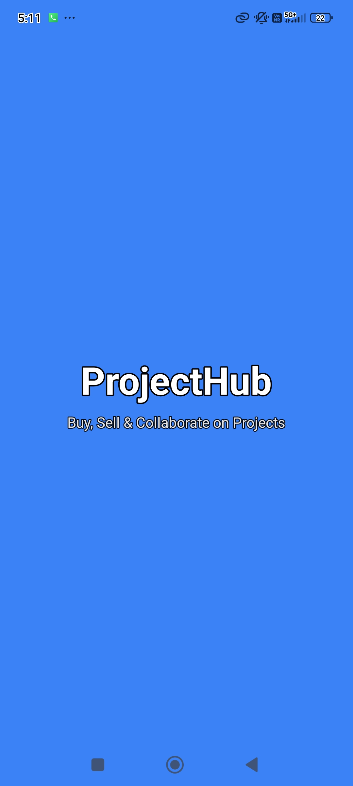
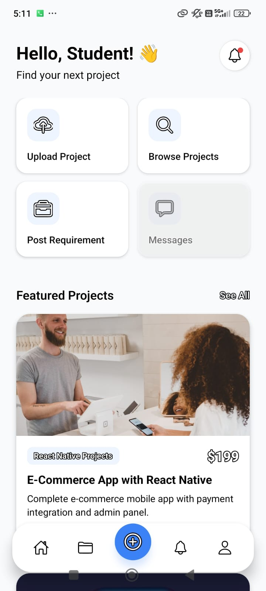
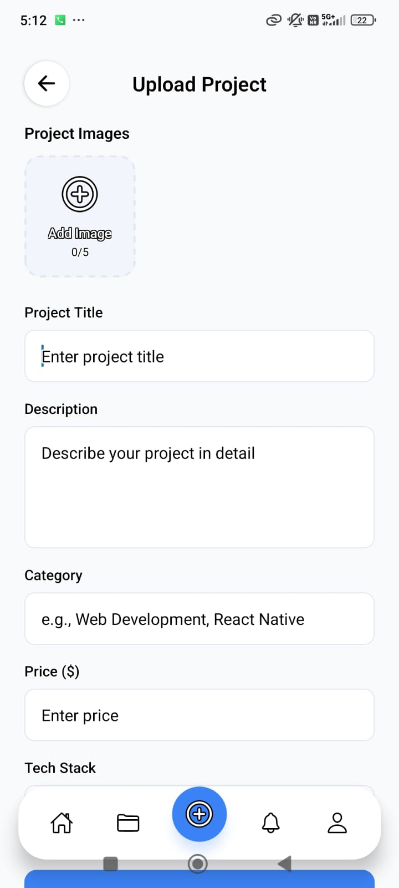
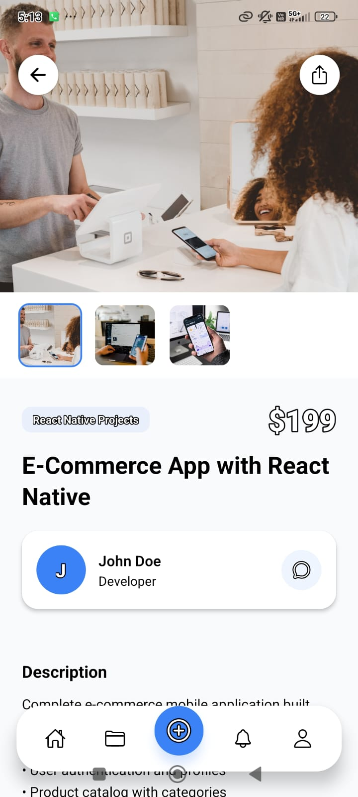

# ProjectHub

A complete React Native mobile app where students, developers, and industries can buy, sell, upload, and assign software projects.

## 📱 Features

### User Roles
- **Student**: Browse, buy, and upload projects
- **Developer**: Sell projects, accept industry work
- **Industry**: Post requirements, hire, track projects

### Core Screens
- ✨ Splash Screen
- 👋 Onboarding Screen
- 🔐 Login / Register
- 🏠 Home Dashboard
- 📂 All Projects
- 🔍 Project Details
- ⬆️ Upload Project
- 📋 Post Industry Requirement
- 👤 Profile & Settings
- 🛎️ Notifications
- 💬 Chat / Messages
- 💳 Payment Screen
- 📁 My Projects
- 📌 Assigned Projects

## 🛠️ Tech Stack
- React Native with Expo Router
- expo-image-picker (for gallery access)
- NativeWind / Tailwind CSS
- Reusable components
- Professional color palette
- Modern UI/UX

## 📦 Installation

```bash
# Install dependencies
npm install

# Start the app
npx expo start

# Run on Android
npx expo start --android

# Run on iOS
npx expo start --ios

# Run on Web
npx expo start --web
```

## 📱 Build APK for Android

### Prerequisites
1. Create an Expo account at https://expo.dev/signup
2. Install EAS CLI:
```bash
npm install -g eas-cli
```

### Build APK Build Steps
1. **Login to Expo:**
```bash
eas login
```

2. **Configure the project (first time only):**
```bash
eas build:configure
```

3. **Build the APK (preview):**
```bash
eas build --platform android --profile preview
```

4. **Wait for build to complete, then download the APK from the Expo dashboard!

### Quick Notes:
- `eas.json` already configured for preview APK builds
- Preview builds take ~10-20 minutes
- APK will be available at https://expo.dev/accounts/[your-account]/projects/projecthub/builds


## �� Screenshots

<table>
  <tr>
    <td></td>
    <td></td>
    <td></td>
    <td></td>
  </tr>
  <tr>
    <td align="center">Splash Screen</td>
    <td align="center">Home Dashboard</td>
    <td align="center">Project Cards</td>
    <td align="center">Project Detail</td>
  </tr>
</table>

## 📂 Project Structure
```
ProjectHub/
├── app/
│   ├── index.tsx
│   ├── splash.tsx
│   ├── onboarding.tsx
│   ├── login.tsx
│   ├── register.tsx
│   ├── _layout.tsx
│   └── (app)/
│       ├── _layout.tsx
│       ├── home.tsx
│       ├── projects.tsx
│       ├── upload.tsx
│       ├── post-requirement.tsx
│       ├── project-detail.tsx
│       ├── notifications.tsx
│       ├── profile.tsx
│       ├── edit-profile.tsx
│       ├── my-projects.tsx
│       ├── assigned-projects.tsx
│       ├── chat.tsx
│       └── payment.tsx
├── components/
│   ├── Button.tsx
│   ├── Input.tsx
│   └── ProjectCard.tsx
├── config/
│   └── firebase.ts
├── constants/
│   ├── Colors.ts
│   └── Data.ts
├── app.json
├── package.json
└── ...
```

## 🎨 Features

- **Modern UI**: Clean, professional design with smooth animations
- **Image Upload**: Gallery access with image preview (up to 5 images)
- **Search & Filters**: Find projects by category, price, technology
- **Floating Tab Bar**: Beautiful custom bottom navigation
- **Image Gallery**: Interactive thumbnail gallery on project details
- **Dummy Data**: Complete app with realistic sample content
- **Reusable Components**: Button, Input, ProjectCard, and more

## 📋 Project Categories
- Web Development
- App Development
- React Native Projects
- MERN Stack Projects
- Java Projects
- Python Projects
- AI/ML Projects
- UI/UX Design
- College Final Year Projects
- Mini Projects
- Industry Projects

## 📱 Permissions

### Gallery Access
- Photos: Used to upload project images
- Configured in `app.json` with custom permission messages

## 🚀 Future Enhancements
- Firebase Authentication & Firestore integration
- Real-time chat functionality
- Payment gateway integration (Stripe/PayPal)
- User profiles with skills showcase
- Industry project assignment tracking
- Notifications system
- Advanced search and filtering

## 📄 License
MIT License - Feel free to use this project for learning and development!

## 🤝 Contributing
Contributions, issues, and feature requests are welcome!

## 📧 Contact
For questions or feedback, please reach out!

---

Built with ❤️ using React Native & Expo
